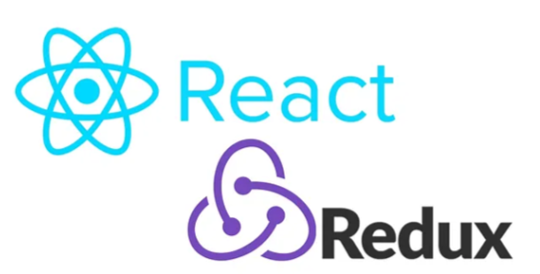

<a name="readme-top"></a>

<div align="center">
  
  <br/><br/>

  <h1><b>React - Front-end</b></h1>

  <br/>

</div>

# 📗 Table of Contents

- [📖 About the Project](#about-project)
  - [🛠 Built With](#built-with)
    - [Tech Stack](#tech-stack)
    - [Key Features](#key-features)
  - [🚀 Live Demo](#live-demo)
- [💻 Getting Started](#getting-started)
  - [Setup](#setup)
  - [Prerequisites](#prerequisites)
  - [Install](#install)
  - [Usage](#usage)
  - [Run tests](#run-tests)
  - [Deployment](#triangular_flag_on_post-deployment)
- [👥 Authors](#authors)
- [🔭 Future Features](#future-features)
- [🤝 Contributing](#contributing)
- [⭐️ Show your support](#support)
- [🔭 Acknowledgements](#acknowledgements)
- [❓ FAQ](#faq)
- [📝 License](#license)


This application allows you to:

- See a random greeting gotten from a rails API

## 🛠 Built With <a name="built-with"></a>

### Tech Stack <a name="tech-stack"></a>

<details>
  <summary>Technology</summary>
  <ul>
    <li>React</li>
    <li>Redux</li>
    <li>Redux toolkit</li>
  </ul>
</details>

<details>
  <summary>Tools</summary>
  <ul>
    <li>VS Code</li>
    <li>GIT</li>
    <li>GITHUB</li>
  </ul>
</details>

<!-- Features -->

### Key Features <a name="key-features"></a>

- Use React to fetch the rails API
- Use WebPack to pack the JavaScript code

<p align="right">(<a href="#readme-top">back to top</a>)</p>

<!-- LIVE DEMO -->

## 🚀 Live Demo <a name="live-demo"></a>

- Sorry, Currently not available

<p align="right">(<a href="#readme-top">back to top</a>)</p>

<!-- GETTING STARTED -->

## 💻 Getting Started <a name="getting-started"></a>

To get a local copy up and running follow these simple example steps.

### Prerequisites

you have to those tools in your local machine.

- [ ] React
- [ ] Redux
- [ ] Redux toolkit
- [ ] GIT & GITHUB
- [ ] Any Code Editor (VS Code, Brackets, etc)

### Clone Repo

Clone the project using the following bash command in an appropriate location.

bash
  git clone https://github.com/juanpa8830/hello-react-front-end.git


Go to the project directory.

bash
  cd hello-react-front-end


### Add necessary packages

For installing necessary packages, run the following bash command:

```react
  npm install
```
### Run the server

In the project directory, you can run the project by using following command:

```react
  npm start
```
### Link to hello-rails-back-end repository:

https://github.com/Juanpa8830/hello-rails-back-end

<p align="right">(<a href="#readme-top">back to top</a>)</p>

<!-- AUTHORS -->

## 👥 Authors <a name="authors"></a>

👤 **Juan Pablo Guerrero**

[](https://github.com/Juanpa8830) [](https://www.linkedin.com/in/juanpabloguerrerorios/)

<p align="right">(<a href="#readme-top">back to top</a>)</p>

## 🔭 Future Features <a name="future-features"></a>

- [ ] *Live demo will added soon*

<p align="right">(<a href="#readme-top">back to top</a>)</p>

<!-- CONTRIBUTING -->

## 🤝 Contributing <a name="contributing"></a>

Contributions, issues, and feature requests are welcome!

Feel free to check the [issues page](../../../issues/).

<p align="right">(<a href="#readme-top">back to top</a>)</p>

<!-- SUPPORT -->

## 👋 Show your support <a name="support"></a>

Give a ⭐️ if you like this project!

<p align="right">(<a href="#readme-top">back to top</a>)</p>

<!-- ACKNOWLEDGEMENTS -->

## 🔭Acknowledgments <a name="acknowledgements"></a>

- My Family.
- [Microverse](microverse.org)

<p align="right">(<a href="#readme-top">back to top</a>)</p>

<!-- FAQ (optional) -->

## ❓ FAQ <a name="faq"></a>

- *Can I use this project for personal use?*

  - Yes, you can use it.

<p align="right">(<a href="#readme-top">back to top</a>)</p>

## 📝 License <a name="license"></a>

This project is [MIT](./LICENSE) licensed.